# Phorm

<!-- ph-badge-start -->
[](https://maven-badges.sml.io/sonatype-central/com.helger/phorm/)
[](https://javadoc.io/doc/com.helger/phorm)

> If this project saved you some time or made your day a little easier, a star would mean a lot — it helps others find it too.
<!-- ph-badge-end -->

This repository contains a simple, standalone validation service (Phorm) accessible by API only.

The implementation of the validation is based on the open source validation engine [phive](https://github.com/phax/phive) and the collection of rules [phive-rules](https://github.com/phax/phive-rules).

"Phorm" is a combination of "PH + form + conform" and is all about standards, compliance, and correctness.

# Phorm in the Peppol flow

Phorm is one service that is typically used at three different points of a Peppol exchange: while the mapping from
  the backend format to UBL / CII is still being developed, at C2 immediately before a document is wrapped and
  transmitted, and - optionally - at C3 when a document has been received.
The validation engine and the rule sets are identical in all three cases, so a document that passes at design time
  passes at run time for the same reason.


Solid lines are the mandatory / primary path; dashed lines are optional or feedback paths.
The three `Phorm` boxes are the same service, called from three different places.
The diagram source is [`docs/phorm-peppol-flow.mmd`](https://github.com/phax/phorm/blob/master/docs/phorm-peppol-flow.mmd),
  a higher quality version for print and editing is [`docs/phorm-peppol-flow.svg`](https://github.com/phax/phorm/blob/master/docs/phorm-peppol-flow.svg).

## ① Development time - mapping verification

While the mapping from the backend format (ERP, accounting software) to UBL or CII is being written, every sample
  document the mapping produces can be validated immediately.
This is the fastest feedback loop available, because it needs no Access Point, no network and no deployment - just
  an HTTP POST against a running Phorm instance.

Phorm is accessible by API only; there is no interactive validation UI.
Two endpoints are relevant here:
* `POST /api/validate/{vesid}` - validate against a rule set that is named explicitly
* `POST /api/dd_and_validate` - let Phorm determine the document type first and validate against the matching rule set

Both deliver JSON by default, XML with the request header `Accept: application/xml` and HTML with the request header
  `Accept: text/html` - the HTML variant is convenient to read the findings directly during development.
Findings from this loop are corrected in the mapping, not in the transmitted document, which is why this touchpoint
  feeds back into development and not into the message flow.

## ② C2, before sending - the outbound gate

At C2 the business document is validated after the mapping has produced it and before SBDH wrapping and AS4
  transmission.
This is the point where validation is worth the most: an invalid document is rejected back to C1 and never enters
  the network at all, so the error is fixed where it originates instead of coming back later as a rejection from
  the far side of the exchange.

Two configuration properties make Phorm usable as a gate and not just as a reporting tool:
* **`phorm.api.requiredtoken`** - the value the `X-Token` HTTP header must carry for any API call to be accepted
* **`phorm.api.response.onfailure.http400`** - if `true` (the default), a failed validation is answered with HTTP 400
  instead of HTTP 200, so the caller can use the HTTP status alone as the gate decision, without parsing the result
  structure first

If the document to be sent is already wrapped in an SBDH, `POST /api/dd_and_validate` unwraps it automatically and
  validates the payload inside.

## ③ C3, on receipt - optional inbound validation

C3 can validate a document after AS4 reception and before handing it over to C4, so that the receiving side knows the
  conformance status of what arrived.
This touchpoint is optional - it is drawn with dashed lines for that reason - and Phorm only produces the validation
  result; what the receiving side does with that result is up to the implementation.

`POST /api/dd_and_validate` fits this position particularly well, because a document arriving over AS4 is SBDH wrapped:
* the SBDH (or XHE) envelope is unwrapped automatically and the payload inside is validated
* the Peppol SBDH envelope constraints are validated as well and returned as an additional first (envelope) validation
  layer in the result (since v2.1.5)
* if the SBDH is valid and the payload is a Peppol BIS Billing or PINT document, the SBDH sender and receiver
  participant IDs are cross checked against the sender and receiver IDs in the payload

All layers are returned in a single phive `ValidationResultList`, so envelope findings and business rule findings are
  available from one call.

## Rule set selection

A validation always runs against one VESID - the coordinate of a validation executor set in the
  [phive-rules](https://github.com/phax/phive-rules) registry.
There are two ways of arriving at one.

**Explicit**: `POST /api/validate/{vesid}` takes the VESID as part of the path, e.g. `eu.peppol.bis3:invoice:latest`.
The caller decides which rules apply.
`GET /api/get/vesids` returns all registered VESIDs.

**Automatic**: `POST /api/determinedoctype`, `POST /api/dd_and_validate` and `POST /api/hybrid_validate` derive the
  VESID from the document itself, using the [ddd](https://github.com/phax/ddd) library:
1. **Syntax detection** - the syntax is determined from the root element namespace URI and the local element name
   (e.g. the namespace `urn:oasis:names:specification:ubl:schema:xsd:Invoice-2` with the local name `Invoice` leads to
   the syntax `ubl2-invoice`)
2. **Field extraction** - each syntax carries a set of XPath expressions to read the generic document fields, among
   them the Customization ID, the Process ID, the Business Document ID and the sender / receiver identifiers, names
   and country codes
3. **Value provider lookup** - the Customization ID selects the concrete profile of that syntax and delivers the VESID
   (as well as the profile name, the syntax version and, for CII based syntaxes, the Process ID).
   E.g. the Customization ID `urn:cen.eu:en16931:2017#compliant#urn:fdc:peppol.eu:2017:poacc:billing:3.0` on a UBL
   Invoice identifies a Peppol BIS Billing UBL Invoice V3 and leads to the VESID `eu.peppol.bis3:invoice:latest-active`
4. **Resolution** - the determined VESID is parsed and looked up in the registry, that is filled on startup from the
   aggregating `phive-rules-all` module.
   If no document details can be determined, or if the determined VESID cannot be parsed or resolved, the call is
   answered with HTTP 400

So in practice the document type identifier and the Customization ID contained in the document decide the rule set,
  and neither C2 nor C3 needs to maintain a mapping table of its own.

<details>
<summary>Mermaid source of the diagram</summary>

The image files are generated from [`docs/phorm-peppol-flow.mmd`](https://github.com/phax/phorm/blob/master/docs/phorm-peppol-flow.mmd) via:

```
npx --yes @mermaid-js/mermaid-cli -i docs/phorm-peppol-flow.mmd \
    -o docs/phorm-peppol-flow.svg -b transparent
npx --yes @mermaid-js/mermaid-cli -i docs/phorm-peppol-flow.mmd \
    -o docs/phorm-peppol-flow.png -b white -s 3
```



</details>

```mermaid
flowchart LR
  %% ---------- development time ----------
  subgraph SDEV["Development time"]
    direction TB
    DEV["Integration developer"]
    SAMPLE["Sample documents<br/>from the mapping"]
    DEV --> SAMPLE
  end

  PH1{{"<b>Phorm</b><br/>validation service"}}

  SAMPLE -->|"① design time:<br/>validate mapping output<br/>(REST API)"| PH1
  PH1 -.->|"findings feed back<br/>into the mapping"| DEV

  %% ---------- the four corner model ----------
  subgraph SC1["C1 — Sender"]
    C1["Sending entity<br/>(ERP / accounting software)"]
  end

  subgraph SC2["C2 — Sending Access Point"]
    direction TB
    M2["Mapping to<br/>UBL / CII<br/>(Peppol BIS, CIUS)"]
    S2["SBDH wrapping<br/>+ AS4 send"]
  end

  PH2{{"<b>Phorm</b><br/>validation service"}}

  subgraph SC3["C3 — Receiving Access Point"]
    direction TB
    R3["AS4 receive<br/>+ SBDH unwrap"]
    H3["Hand over to C4"]
  end

  PH3{{"<b>Phorm</b><br/>validation service"}}

  subgraph SC4["C4 — Receiver"]
    C4["Receiving entity<br/>(ERP / accounting software)"]
  end

  %% ---------- touchpoint 2: C2 outbound gate ----------
  C1 --> M2
  M2 -->|"② outbound gate:<br/>validate before sending"| PH2
  PH2 -->|"valid → transmit"| S2
  PH2 -.->|"invalid → reject to C1,<br/>nothing enters the network"| C1

  %% ---------- transmission ----------
  S2 -->|AS4| R3

  %% ---------- touchpoint 3: C3 inbound, optional ----------
  R3 -.->|"③ optional:<br/>validate on receipt"| PH3
  PH3 -.->|"result available for<br/>C4 processing"| H3
  H3 --> C4

  classDef corner fill:#f5f7fa,stroke:#4a5568,stroke-width:1px,color:#1a202c
  classDef devbox fill:#fdf6e3,stroke:#8a6d3b,stroke-width:1px,color:#1a202c
  classDef service fill:#e6f2ff,stroke:#1f5fa9,stroke-width:2px,color:#0b2545
  class C1,M2,S2,R3,H3,C4 corner
  class DEV,SAMPLE devbox
  class PH1,PH2,PH3 service

  style SDEV fill:#fffaf0,stroke:#c8b48a,color:#1a202c
  style SC1 fill:#ffffff,stroke:#a0aec0,color:#1a202c
  style SC2 fill:#ffffff,stroke:#a0aec0,color:#1a202c
  style SC3 fill:#ffffff,stroke:#a0aec0,color:#1a202c
  style SC4 fill:#ffffff,stroke:#a0aec0,color:#1a202c
```

# Development environment

* Requires Java 17 or newer - Java 21 or later is recommended
* [Apache Maven](https://maven.apache.org) is used as the build tool. May be abstracted by a Docker image.
* Coding language: English

# HTTP Endpoints

Phorm exposes two kinds of HTTP endpoints: a handful of top-level servlets (root page, health check and status) and the REST API below `/api`.

| Method | Path | Servlet / Handler | Purpose |
|---|---|---|---|
| GET | `/` | `RootServlet` | HTML landing page. In test versions it lists the supported APIs and all registered VESIDs; otherwise it shows only the application name |
| GET | `/ping` | `PingPongServlet` | Health / keep-alive check, always replies with the plain text `pong` |
| GET | `/status` | `StatusServlet` | Application status as a JSON structure (see below) |
| POST | `/api/validate/{vesid}` | `ApiPostValidate` | Validate a payload against a specific VESID |
| GET | `/api/get/vesids` | `ApiGetAllVESIDs` | List all registered VESIDs |
| POST | `/api/determinedoctype` | `ApiPostDetermineDocDetails` | Auto-detect the document format of a payload |
| POST | `/api/dd_and_validate` | `ApiPostDetermineDocTypeAndValidate` | Detect the document type and validate in one call |
| POST | `/api/hybrid_validate` | `ApiPostHybridValidate` | Validate a ZUGFeRD / Factur-X hybrid PDF invoice |

## REST API

The service offers the following REST APIs below `/api`.

* POST **`/api/validate/{vesid}`**
  * Validate the provided payload in the body against the validation rules, identified by `{vesid}`
  * Requires the HTTP header `X-Token` to have the configured value (see below for `phorm.api.requiredtoken`)
  * If the HTTP Request Header `Accept` with value `application/xml`  is present, the result is an XML structure. Else the result is a JSON structure
  * Test invocation (replace `XXX` with real token):
    * `curl -X POST -H "Content-Type: application/xml" -H "X-Token: XXX" -d @src/test/resources/testfiles/peppol-bis3/base-example.xml http://localhost:8080/api/validate/eu.peppol.bis3:invoice:latest`
* GET **`/api/get/vesids`**
  * Get a list of all registered VESIDs
  * The optional URL parameter `include-deprecated` can be used to also return registered, but deprecated VES IDs. No parameter value is needed
  * The result is a JSON structure
    * `curl -X GET http://localhost:8080/api/get/vesids`
* POST **`/api/determinedoctype`**
  * Try to detect the format and payload specifics of a document instance.
  * The document instance must be the POST payload.
  * Requires the HTTP header `X-Token` to have the configured value (see below for `phorm.api.requiredtoken`)
  * The result is a JSON structure
  * Test invocation (replace `XXX` with real token):
    * `curl -X POST -H "Content-Type: application/xml" -H "X-Token: XXX" -d @src/test/resources/testfiles/peppol-bis3/base-example.xml http://localhost:8080/api/determinedoctype`
  * Example output:
```json
{
  "syntaxID":"ubl2-invoice",
  "syntaxVersion":"2.1",
  "sender":"iso6523-actorid-upis::0088:9482348239847239874",
  "receiver":"iso6523-actorid-upis::0002:FR23342",
  "doctype":"busdox-docid-qns::urn:oasis:names:specification:ubl:schema:xsd:Invoice-2::Invoice##urn:cen.eu:en16931:2017#compliant#urn:fdc:peppol.eu:2017:poacc:billing:3.0::2.1",
  "process":"cenbii-procid-ubl::urn:fdc:peppol.eu:2017:poacc:billing:01:1.0",
  "customizationID":"urn:cen.eu:en16931:2017#compliant#urn:fdc:peppol.eu:2017:poacc:billing:3.0",
  "bdid":"Snippet1",
  "senderName":"SupplierTradingName Ltd.",
  "senderCountryCode":"GB",
  "receiverName":"BuyerTradingName AS",
  "receiverCountryCode":"SE",
  "vesid":"eu.peppol.bis3:invoice:latest-active",
  "profileName":"Peppol BIS Billing UBL Invoice V3"
}
```
* POST **`/api/dd_and_validate`**
  * Determine the document type and afterwards validate the provided payload in the body against the determined validation rules
    If the payload is wrapped in an SBDH or XHE, the payload document is automatically unwrapped.
    If the payload is wrapped in a Peppol SBDH, its envelope constraints are automatically validated and returned as an
    additional first (envelope) validation layer in the result (since 2.1.5). Additionally, if the SBDH is valid and the
    payload is a Peppol BIS Billing / PINT document, the SBDH sender and receiver participant IDs are cross-checked against
    the payload sender and receiver IDs (they must match according to the Peppol BIS Billing rules).
  * Requires the HTTP header `X-Token` to have the configured value (see below for `phorm.api.requiredtoken`)
  * If the HTTP Request Header `Accept` with value `application/xml` is present, the result is an XML structure.
    If the HTTP Request Header `Accept` with value `text/html` is present, the result is an HTML file.
    Else the result is a JSON structure.
  * Test invocation (replace `XXX` with real token):
    * `curl -X POST -H "Content-Type: application/xml" -H "X-Token: XXX" -d @src/test/resources/testfiles/peppol-bis3/base-example.xml http://localhost:8080/api/dd_and_validate/`
* POST **`/api/hybrid_validate`**
  * Validate a ZUGFeRD / Factur-X hybrid PDF invoice. The PDF must be the POST body. The carrier-side rules
    (BR-HYBRID-* business rules and PDF/A-3 conformance via veraPDF) are evaluated by [kaltblut](https://github.com/phax/kaltblut),
    then the embedded XML is extracted, its document type auto-determined (as in `/api/dd_and_validate`), and
    its XML business rules applied.
    All layers are returned in a single phive `ValidationResultList`, with the PDF carrier layers first.
  * Requires the HTTP header `X-Token` to have the configured value (see below for `phorm.api.requiredtoken`)
  * Optional URL query parameter `country=DE|FR|OTHER` drives the country-specific BR-HYBRID rules
    (BR-HYBRID-DE-*, BR-HYBRID-FR-*, BR-FX-DE-03 PDF/A downgrade). Defaults to `OTHER`.
  * Response format follows the same `Accept` header convention as `/api/dd_and_validate`
    (JSON by default, XML on `application/xml`, HTML on `text/html`)
  * Test invocation (replace `XXX` with real token):
    * `curl -X POST -H "Content-Type: application/pdf" -H "X-Token: XXX" --data-binary @invoice.pdf "http://localhost:8080/api/hybrid_validate?country=DE"`

## Servlets

* GET **`/`** (`RootServlet`)
  * Returns an HTML page.
  * When the application runs as a "test version" (see `webapp.testversion`), the page additionally lists all supported APIs and all registered VESIDs.
  * The optional URL parameter `include-deprecated` also lists deprecated VESIDs. No parameter value is needed.
  * Test invocation:
    * `curl http://localhost:8080/`
* GET **`/ping`** (`PingPongServlet`)
  * Health check / keep-alive endpoint.
  * Always returns the plain text (`text/plain`) body `pong`. Caching is disabled.
  * Test invocation:
    * `curl http://localhost:8080/ping`
* GET **`/status`** (`StatusServlet`)
  * Returns application status as a JSON structure. Caching is disabled.
  * Only delivers data if `phorm.statusapi.enabled` is `true`; otherwise it returns `{"status.enabled":false}`.
  * Test invocation:
    * `curl http://localhost:8080/status`
  * Example output:
```json
{
  "build.timestamp":"...",
  "startup.datetime":"2026-07-23T08:00:00Z",
  "status.datetime":"2026-07-23T09:15:00Z",
  "version.pp":"2.2.0",
  "version.java":"21",
  "global.debug":false,
  "global.production":true
}
```

# Configuration

Phorm comes with one configuration file called `application.properties`.
The lookup rules for the file is defined in https://github.com/phax/ph-commons/wiki/ph-config

It supports the following settings:
* **`global.debug`**: overall debug mode.
  This enables additional checks that should not be executed every time (e.g. because they are slow or because they are spamming the logfile etc.).
  This flag has no impact on the logging level.
  This flag should be set to `true` in development mode, but to `false` in production mode.
  The value of this field is internally maintained in class `com.helger.commons.debug.GlobalDebug`.
* **`global.production`**: overall production mode.
  If this flag is set to `false` certain functionality not applicable in development environment (like mass mail sending) is disabled.
  This flag should be set to `true` in production mode.
* **`webapp.datapath`**: the path where all relevant data and settings are stored.
  This can e.g. be a relative path (like `conf` - relative to the web application directory) for development purposes but should be an absolute path (e.g. `/config/phorm`) in production.
  Make sure the user running Phorm has write access to this folder.
* **`webapp.checkfileaccess`**: a flag that determines whether the directory of the web application should be checked for read and write access.
  This is only required if the data path inside the web application and should therefore always be `false`.
* **`webapp.testversion`**: a special indicator for the web application whether the version should be highlighted as a "test" version.
  Set to `true` in debug mode and `false` in production mode.
* **`phorm.statusapi.enabled`**: a flag that indicates, if the status API (`/status`) should deliver data or not.
* **`phorm.api.requiredtoken`**: the specific value of the `X-Token` header that must be provided to access the API.
  Customize this once and don't share it. The development default is `phorm-dev-token`.
* **`phorm.api.response.onfailure.http400`**: a flag to indicate, whether the API should return HTTP 400 (Bad Request) on failed validations or not.
  The default is `true` for backwards compatibility reasons.
* **`phorm.api.response.log.payload`**: a flag to indicate, whether the validation response should be logged in the console or not.
  The default is `false`.
* **`phorm.telemetry.enabled`**: a flag that enables in-process OpenTelemetry SDK initialisation at startup so spans and metrics are exported.
  The default is `false` — when disabled, every telemetry call inside Phorm collapses to a cheap no-op and no OTel network connection is opened.
  Set to `true` to opt in.

## OpenTelemetry

When `phorm.telemetry.enabled=true`, Phorm initialises the OpenTelemetry SDK once at startup via `AutoConfiguredOpenTelemetrySdk` (no Java agent required). Configure exporters and resource attributes with the standard OTel environment variables (or `-D` system properties) — Phorm itself adds nothing on top:

| Variable | Purpose |
|---|---|
| `OTEL_SERVICE_NAME` | service.name resource attribute, e.g. `phorm` |
| `OTEL_EXPORTER_OTLP_ENDPOINT` | OTLP collector endpoint, e.g. `http://collector:4317` |
| `OTEL_EXPORTER_OTLP_PROTOCOL` | `grpc` (default) or `http/protobuf` |
| `OTEL_TRACES_EXPORTER` / `OTEL_METRICS_EXPORTER` | `otlp` (default), `none` to disable per signal, etc. |
| `OTEL_RESOURCE_ATTRIBUTES` | extra resource attributes, e.g. `deployment.environment=prod` |

See the [OpenTelemetry SDK autoconfigure docs](https://github.com/open-telemetry/opentelemetry-java/tree/main/sdk-extensions/autoconfigure) for the full list. Span names are documented in `com.helger.phorm.telemetry.CPhormTelemetry` (`phorm.api.*`, `phorm.auth.check`, `phorm.payload.read`, `phorm.xml.parse`, `phorm.ddd.determine`, `phorm.vesid.resolve`, `phorm.phive.validate`, `phorm.kaltblut.*`); metric names are in `com.helger.phorm.telemetry.PhormMetrics` (`phorm.requests.received`, `phorm.validation.runs`, `phorm.validation.duration`, `phorm.validation.findings`, `phorm.payload.bytes`, `phorm.ddd.determinations`, `phorm.vesid.resolutions`, `phorm.kaltblut.*`, `phorm.ves.registry.size`).

For testing purposes use e.g. those values:
```
OTEL_EXPORTER_OTLP_ENDPOINT="http://localhost:4317"
OTEL_EXPORTER_OTLP_PROTOCOL="grpc"
OTEL_SERVICE_NAME="phorm"
OTEL_RESOURCE_ATTRIBUTES="service.namespace=com.helger,service.version=1.0.0,deployment.environment=local"
OTEL_TRACES_EXPORTER="otlp"
OTEL_METRICS_EXPORTER="otlp"
OTEL_LOGS_EXPORTER="otlp"
```

# Building

## From Source

* Requires Java 17 or higher
* Build with Apache Maven 3.x - via `mvn clean install`

* Alternatively build with a Docker Maven image:

```
build-with-docker.cmd clean install
```
or
```
./build-with-docker.sh clean install
```

## Docker image

Building:

```shell
docker build --pull -t phelger/phorm .
```

The old image tag `phelger/valsvc` is also maintained for backwards compatibility:
```shell
docker tag phelger/phorm phelger/valsvc
```

Running:

```shell
docker run -d --name phorm -p 8080:8080 phelger/phorm
```

Example curl command (use the correct "X-Token" and the right address):
```
curl -d "@base-example.xml" -H "Content-Type: application/xml" -H "X-Token: XXX" -X POST http://localhost:8080/api/validate/eu.peppol.bis3:invoice:latest
```

## Standard Docker images

Pre-built Docker images are available on Docker Hub:

* `phelger/phorm` — for **linux/amd64**
* `phelger/phorm-arm64` — for **linux/arm64**

Both images are tagged with the specific version (e.g. `2.0.0`) as well as `latest`.

The multi-architecture build script is located in `docker/build-all.sh`.

# Phorm Updates

If an update is made to the validation, you have to do a `git pull` and recompile.

To make sure your own configuration is kept unchanged, my suggestion is to create a file `private-application.properties`
  in the `src/main/resources` folder of your checked-out copy (same folder as `application.properties`),
  where you can adjust or change all the configuration entries that are important to you.

The file with this specific name and within this folder has a higher priority than the default
  `application.properties` file and is also marked as "ignored" in git, i.e. changes to this file
  are not overwritten during updates from the repository.
If the file is in the correct folder, it will also be included in the compilation process and
  is therefore available out of the box for Phorm.

As an alternative to using `private-application.properties` you may also consider using
   environment variables or Java system properties for the configuration -
   see https://github.com/phax/ph-commons/wiki/ph-config for details.

# News and noteworthy

v2.2.7 - 2026-09-06
* Updated to phive-rules 4.5.6
* Added the section "Phorm in the Peppol flow" with a diagram showing the three points where Phorm is used in a Peppol exchange

v2.2.6 - 2026-08-23
* Updated to phive-rules 4.5.4

v2.2.5 - 2026-08-09
* Updated to phive-rules 4.5.3

v2.2.4 - 2026-08-06
* Updated to phive-rules 4.5.2

v2.2.3 - 2026-08-05
* Disabled the audit logging, as Phorm is a stateless validation service and does not need it.
  No more `audits` folder is created below the configured `webapp.datapath`
* Updated to phive-rules 4.5.1

v2.2.2 - 2026-08-03
* Updated to phive-rules 4.5.0

v2.2.1 - 2026-07-30
* Updated to phive-rules 4.4.2
* Fixes [issue #17](https://github.com/phax/phorm/issues/17) - thx @ic-officient

v2.2.0 - 2026-07-19
* Updated to phive 12.1.0
* Updated to phive-rules 4.4.0
* Updated to ph-schematron 10.0.0
* Updated to kaltblut 0.9.4
* Switched to the aggregating `phive-rules-all` module, so all available rule sets are registered automatically

v2.1.6 - 2026-07-09
* Updated to phive-rules 4.3.9
* Include existing phive-rules submodule `phive-rules-isdoc`, `phive-rules-osa` and `phive-rules-serbia`

v2.1.5 - 2026-07-02
* Added validation of Peppol SBDH envelope constraints in `/api/dd_and_validate`, returned as an additional first validation layer.
  See [#14](https://github.com/phax/phorm/issues/14) - thx @dmaus2018
* Added a Peppol BIS Billing check in `/api/dd_and_validate` that the SBDH sender/receiver participant IDs match the payload sender/receiver IDs.
  See [#14](https://github.com/phax/phorm/issues/14) - thx @PontusPaulsson

v2.1.4 - 2026-07-01
* Added OpenTelemetry support

v2.1.3 - 2026-06-15
* Updated to phive-rules 4.3.8

v2.1.2 - 2026-05-29
* Updated to phive-rules 4.3.5
* Updated to ddd 0.8.8

v2.1.1 - 2026-05-21
* Updated to phive-rules 4.3.3

v2.1.0 - 2026-05-14
* Updated to phive-rules 4.3.2 (including new rules for Hungarian invoice format)
* Updated to ddd 0.8.7
* Added new API `/api/hybrid_validate` for ZUGFeRD / Factur-X hybrid PDF invoices.
  The PDF carrier (BR-HYBRID-* + PDF/A-3 via veraPDF) is validated by [kaltblut](https://github.com/phax/kaltblut)
  and the embedded invoice XML is auto-detected and validated against the matching VESID; both
  layers are returned in a single `ValidationResultList`. An optional `?country=DE|FR|OTHER`
  query parameter drives the country-specific BR-HYBRID rules.

v2.0.4 - 2026-05-09
* Updated to phive-rules 4.3.1 (including new rules for Turkish invoice format)
* Updated to ddd 0.8.6

v2.0.3 - 2026-04-10
* Updated to phive 12.0.3
* Updated to ddd 0.8.5
* Added support for automatic unwrapping of SBDH/XHE envelopes in `/dd_and_validate`.
  See [#11](https://github.com/phax/phorm/issues/11)

v2.0.2 - 2026-04-02
* Updated to phive 12.0.2 and phive-rules 4.3.0

v2.0.1 - 2026-03-25
* Updated to phive-rules 4.2.5

v2.0.0 - 2026-03-18
* Made the repository public - thanks for all the supporters!!!
* Starting to use semantic versioning

2026-03-17
* Updated to phive 12.0.1 and phive-rules 4.2.3

2026-03-12
* **Rebranding**: the project has been renamed from "Validation Service" / "valsvc" to **Phorm**
* The Maven artifact ID changed from `validation-service` to `phorm`, so the WAR file is now `phorm.war` instead of `validation-service.war`
* The Java package was renamed from `com.helger.valsvc` to `com.helger.phorm`
* The Docker image is now `phelger/phorm` (the old tag `phelger/valsvc` is still provided for backwards compatibility)
* Configuration property keys were renamed from `valsvc.*` to `phorm.*` (e.g. `valsvc.api.requiredtoken` → `phorm.api.requiredtoken`).
  The old `valsvc.*` keys are still accepted as fallback values.
* The log prefix changed from `[VAL-SVC]` to `[PHORM]`
* The default Docker data path changed from `/config/valsvc` to `/config/phorm`

2026-02-22
* Updated to phive 12.0.0 and phive-rules 4.2.0
* Both `/api/validate/` and `/api/dd_and_validate` are now able to create HTML results (first draft)

2026-02-18
* Updated to phive-rules 4.1.8

2025-09-02
* The API `/api/determinedoctype` can now also return XML payload
* Fixed an error with the document type ID scheme for PINT document types in determination

2025-08-29
* The minimum requirement is now Java 17

2025-03-23
* Added new API `/api/dd_and_validate` to run document type detection and validation in one call
* Changed the default value of `phorm.api.response.log.payload` (formerly `valsvc.api.response.log.payload`) to `false`

2025-03-10
* Added the new phive-rules-zatca for Saudi Arabian invoice

2025-03-08
* Added all other remaining validation rules from phive-rules

2025-03-04
* Added Danish OIOUBL rules to the ruleset

2025-01-09
* The API `/api/validate/{vesid}` can return JSON or XML (depending on the `Accept` header)

2024-12-06
* Added new API `/api/determinedoctype` to auto detect payload details

2024-12-05
* the new configuration property `phorm.api.response.log.payload` (formerly `valsvc.api.response.log.payload`) can be used to disable logging of the result JSON
* Added support for German ZuGFERD XML invoices 

2024-12-03
* the new configuration property `phorm.api.response.onfailure.http400` (formerly `valsvc.api.response.onfailure.http400`) can be used to disable returning HTTP 400 on validation failure

2024-09-17
* updated to phive v10 and ph-diver v3

2024-05-23
* added UBL.BE rules as well 

2024-01-10
* added XRechnung rules as well

---

My personal [Coding Styleguide](https://github.com/phax/meta/blob/master/CodingStyleguide.md) |
It is appreciated if you star the GitHub project if you like it.
